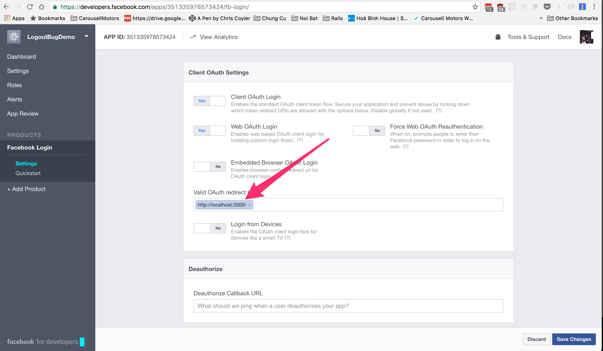
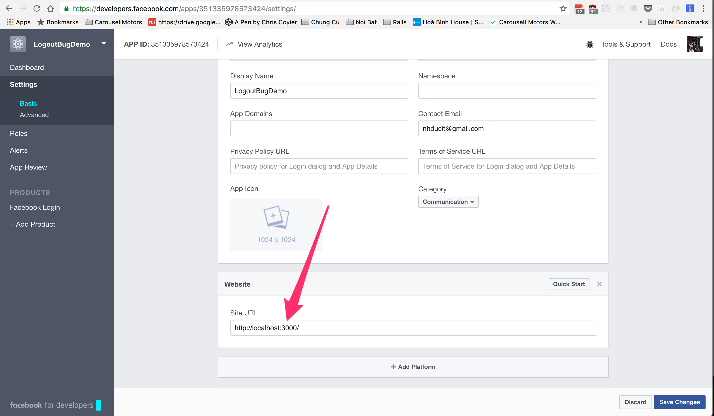
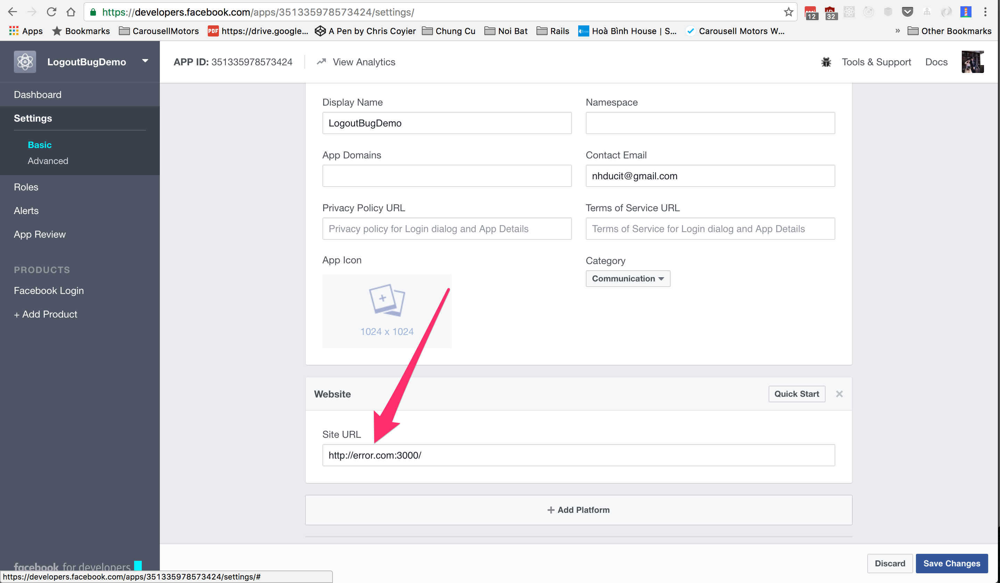
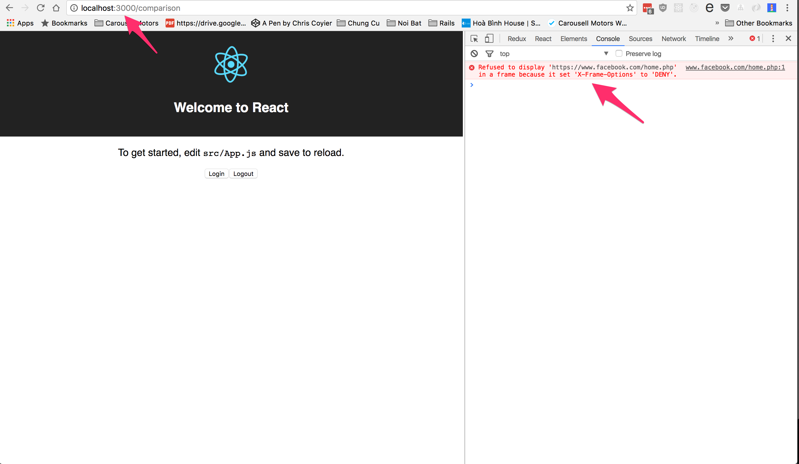

#Reproduce steps:

- Run `yarn install` command
- Run `yarn start` command
- Open `http://localhost:3000`

Configure facebook login like this:

##OK configuration

####Login setting

####Basic setting

- Click login button
- Click logout button
- My website works `OK` with these settings

## Error configuration

####Login setting (same as above)

####Basic setting
Change `http://localhost:3000` to `http://error.com:3000`

- Open this link `http://localhost:3000`
- Click login button
- Click logout button
- Check the console output

